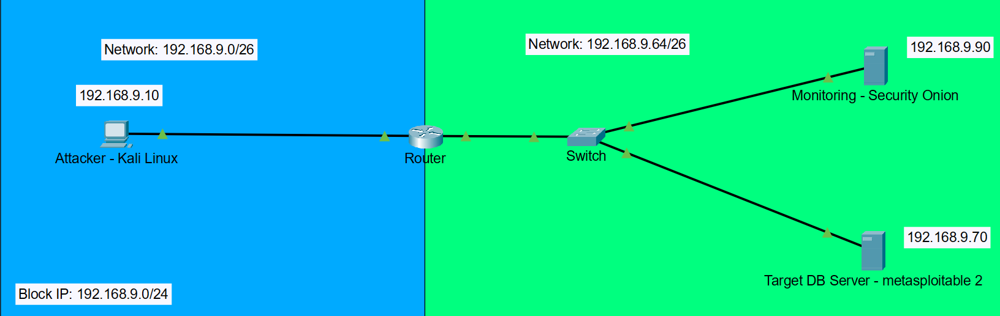
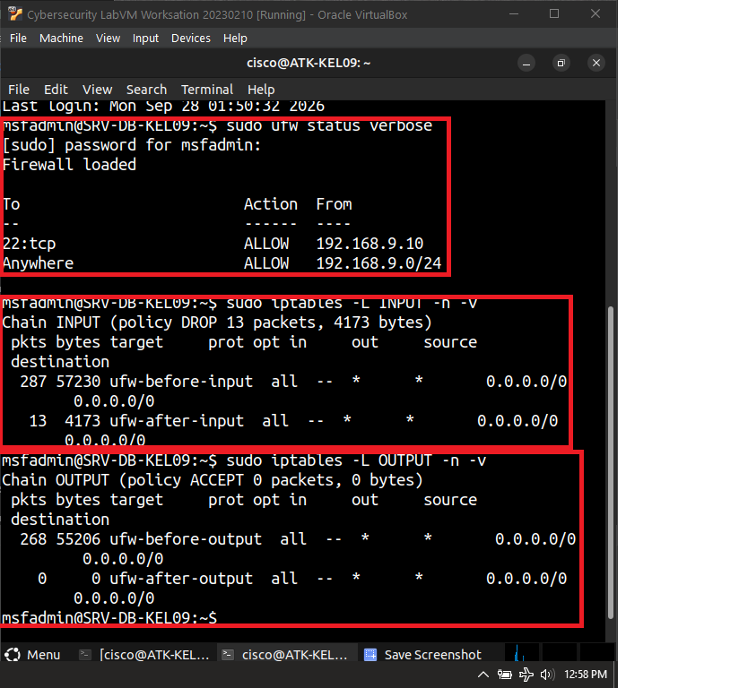
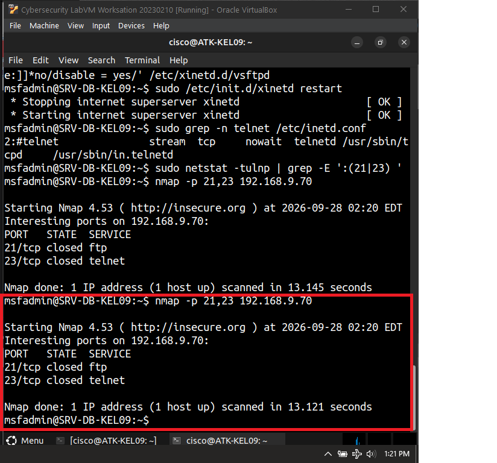
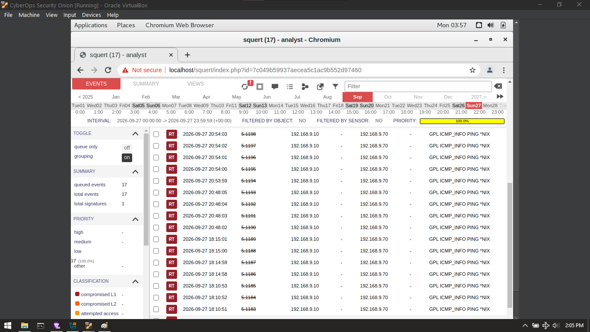

# Baseline Report - Fase 1 (Hardening Review)

**Mata Kuliah:** TEK1314 Keamanan Siber  
**Kelompok:** Kelompok 9  
**Minggu:** 7

**Anggota:**

- Wahyu Pratomo - J0404241008 - Project Leader
- Zenko Erwin Ardiansyah - J0404241037 - Security Monitoring
- Ahdi Khalida Fathir - J0404241043 - Penetration Tester
- Hilman Rabbani Dwinarno - J0404241123 - Network Hardener

---

## 1. Ringkasan

Laporan ini berisi dokumentasi hasil hardening sistem "before attack" pada infrastruktur kelompok, termasuk konfigurasi jaringan, konfigurasi sistem, dan verifikasi bahwa aktivitas jaringan sudah terpantau melalui Security Onion, sebagai persiapan sebelum memasuki fase simulasi serangan (Fase 2).

---

## 2. Topologi & Identitas Sistem

### 2.1 Diagram Topologi



### 2.2 Penjelasan Alur Data

Topologi menggunakan block IP 192.168.9.0/24 yang dipecah menjadi dua segmen /26:

- **Zona Luar (Attacker):** 192.168.9.0/26 - berisi mesin Attacker (Kali Linux).
- **Zona Dalam (Target + Monitoring):** 192.168.9.64/26 - berisi Target DB Server dan Security Onion.

Kedua segmen dipisahkan oleh sebuah router yang berfungsi sekaligus sebagai gateway dan firewall. Alur data: Attacker (Kali Linux) mengirim traffic melalui router/firewall menuju Target DB Server di zona dalam. Security Onion, yang berada pada segmen jaringan yang sama dengan target (192.168.9.64/26), berperan sebagai sensor pasif yang menangkap dan mencatat seluruh traffic yang masuk ke zona dalam, termasuk traffic dari Attacker.

### 2.3 Identitas Standar

| Item | Nilai |
| :---- | :---- |
| Hostname Server | SRV-DB-KEL09 |
| IP Address Server (Target - DB Server) | 192.168.9.70 (network 192.168.9.64/26) |
| Sistem Operasi Server | Metasploitable 2 |
| Hostname Monitoring | SecOnion |
| IP Address Monitoring (Security Onion) | 192.168.9.90 (network 192.168.9.64/26) |
| Sistem Operasi Monitoring | Security Onion |
| Hostname Attacker | ATK-KEL09 |
| IP Address Attacker | 192.168.9.10 (network 192.168.9.0/26) |
| Sistem Operasi Attacker | Kali Linux |
| Subnet Mask | 255.255.255.0 |

<!-- VERIFIKASI: segmen di 2.2 adalah /26 (255.255.255.192), sedangkan tabel ini menulis 255.255.255.0. Samakan dengan konfigurasi interface yang sebenarnya. -->

---

## 3. Network Hardening

### 3.1 Firewall

**Jenis firewall yang digunakan:** UFW dan iptables

**Kebijakan default:**

- Incoming: deny
- Outgoing: allow

**Rule yang diterapkan:**

```text
msfadmin@SRV-DB-KEL09:~$ sudo ufw status verbose
Firewall loaded

To                         Action  From
--                         ------  ----
22:tcp                     ALLOW   192.168.9.10
Anywhere                   ALLOW   192.168.9.0/24

msfadmin@SRV-DB-KEL09:~$ sudo iptables -L INPUT -n -v
Chain INPUT (policy DROP 13 packets, 4173 bytes)

msfadmin@SRV-DB-KEL09:~$ sudo iptables -L OUTPUT -n -v
Chain OUTPUT (policy ACCEPT 0 packets, 0 bytes)
```

**Port yang dibuka (dan alasannya):**

Berdasarkan analisis potensi celah, port-port berikut pada Target DB Server (192.168.9.70) perlu perhatian khusus saat hardening:

| Port | Service | Status | Catatan Hardening |
| :---- | :---- | :---- | :---- |
| 22 | SSH | Dibatasi | Jalur initial foothold; akses dibatasi oleh firewall hanya dari IP Attacker (192.168.9.10) dan subnet lab 192.168.9.0/24, sedangkan koneksi dari jaringan lain ditolak oleh kebijakan default deny incoming. Login root langsung melalui SSH juga dinonaktifkan (lihat 4.2). |
| 5432 | PostgreSQL | Dibuka (terbatas subnet lab) | Service sengaja dibiarkan aktif untuk skenario Fase 2; akses jaringan dibatasi hanya dari subnet lab 192.168.9.0/24 oleh kebijakan default deny incoming. |
| 3306 | MySQL | Dibuka (terbatas subnet lab) | Metasploitable 2 default: MySQL 5.0 tanpa autentikasi (root tanpa password); akses jaringan dibatasi hanya dari subnet lab 192.168.9.0/24. Service sengaja dibiarkan aktif untuk skenario Fase 2. |

**Catatan:** Karena target menggunakan image Metasploitable 2 yang memang didesain rentan untuk keperluan simulasi, kelompok sengaja membiarkan service rentan tetap aktif sebagai bahan skenario Fase 2 (VA/Exploitation), termasuk port 5432 dan 3306. Mitigasi yang diterapkan pada level jaringan adalah kebijakan default deny incoming dengan izin akses hanya dari subnet lab 192.168.9.0/24, sehingga service tersebut tidak dapat dijangkau dari luar jaringan pengujian.

**Bukti screenshot:** `./assets/firewall-config.png`



---

## 4. System Hardening

### 4.1 Penonaktifan Layanan Tidak Perlu

| Layanan | Status Sebelum | Status Sesudah | Alasan |
| :---- | :---- | :---- | :---- |
| telnet (port 23) | Aktif | Dinonaktifkan | Rentan, tidak terenkripsi sehingga kredensial dikirim sebagai teks biasa dan dapat disadap |
| FTP vsftpd 2.3.4 (port 21) | Aktif | Dinonaktifkan | Tidak digunakan dalam skenario, dan versi ini memiliki backdoor yang dikenal |

**Perintah yang digunakan:**

```bash
sudo sed -i 's/^telnet/#telnet/' /etc/inetd.conf
sudo sed -i 's/disable[[:space:]]*=[[:space:]]*no/disable = yes/' /etc/xinetd.d/vsftpd
sudo /etc/init.d/xinetd restart
```

### 4.2 Pengaturan Hak Akses User (Non-Root)

- Dibuat user non-root `opskel09` untuk keperluan operasional (`sudo adduser opskel09`), sehingga administrasi tidak dilakukan langsung dengan akun root.
- Hak sudo dibatasi melalui `/etc/sudoers` (`visudo`), hanya untuk perintah `/usr/sbin/ufw` dan `/usr/bin/apt-get`, sehingga user tersebut tidak memiliki akses administratif penuh.
- Login root langsung melalui SSH dinonaktifkan dengan `PermitRootLogin no` pada `/etc/ssh/sshd_config`, lalu layanan SSH di-restart.

**Bukti screenshot:** `./assets/user-access-config.png`



### 4.3 Update Security Patch

| Tanggal Update | Perintah | Status |
| :---- | :---- | :---- |
| 28/09/2026 | `sudo apt update && sudo apt upgrade -y` | Berhasil |

<!-- VERIFIKASI: Metasploitable 2 berbasis Ubuntu 8.04 yang repositorinya sudah diarsipkan; apt update/upgrade biasanya gagal tanpa mengubah sources.list. Tambahkan screenshot atau catatan penyesuaian jika ada. -->

---

## 5. Logging & Monitoring (Security Onion)

### 5.1 Status Instalasi

- Security Onion terinstal: Ya
- Versi: 16.04.8 LTS (Xenial Xerus)
- Mode: Standalone

### 5.2 Skenario Pengujian Logging

Aktivitas yang diuji: **Ping (ICMP)** dari terminal penyerang/client ke server target.

| Item | Nilai |
| :---- | :---- |
| IP Asal (Client/Attacker) | 192.168.9.10 |
| IP Tujuan (Server) | 192.168.9.70 |
| Waktu Pengujian | 27 September 2026, 21:03 UTC (14:03 waktu lokal komputer) |
| Tool Dashboard | Squert |

<!-- VERIFIKASI: waktu di sini (21:03 UTC) berbeda dengan timestamp di 5.4 (20:48:02 - 20:48:05). Samakan dengan screenshot Squert. Selain itu 21:03 UTC -> 14:03 berarti UTC-7; cek zona waktu komputer (kalau WIB, padanannya 04:03 tanggal 28/09). -->

### 5.3 Bukti Visual

Screenshot dashboard Sguil/Squert yang menampilkan aktivitas ICMP tersebut:



### 5.4 Verifikasi Detail Log

Detail log pada Squert menunjukkan:

| Item | Nilai |
| :---- | :---- |
| Timestamp | 2026-09-27 20:48:02 s.d. 20:48:05 |
| Source IP | 192.168.9.10 (Attacker) |
| Destination IP | 192.168.9.70 (Server Target) |
| Protokol | ICMP |
| Signature | GPL ICMP_INFO PING \*NIX (sid 2100366) |
| Sensor | seconion-import |
| Jumlah event | 12 event dengan signature yang sama, satu event per paket ping |

<!-- VERIFIKASI: (a) 12 event dalam ~3 detik tidak cocok dengan ping interval default 1 detik; tulis perintah ping yang dipakai (mis. -c / -i). (b) sensor "seconion-import" biasanya dipakai untuk impor pcap; kalau alert berasal dari traffic live tidak masalah, kalau bukan, sesuaikan kalimat "interface sniffing" di kesimpulan. (c) Kesimpulan menyebut verifikasi di Kibana; tambahkan screenshot Kibana jika ada. -->

**Kesimpulan:** Log yang tercatat sesuai dengan skenario pengujian, yaitu ping (ICMP) dari 192.168.9.10 ke 192.168.9.70. Sensor Security Onion bekerja dengan baik karena traffic berhasil ditangkap pada interface sniffing, dianalisis oleh Snort, dan dicatat di Sguil/Squert serta terverifikasi silang di Kibana.

---

## 6. Alasan Pemilihan Metode Hardening

Hardening dilakukan pada Target DB Server (SRV-DB-KEL09, Metasploitable 2) dengan prinsip memperkecil attack surface dan menerapkan least privilege sebelum fase pengujian serangan.

### 6.1 Firewall (UFW dan iptables)

UFW dipilih karena sintaksnya sederhana dan mudah diaudit lewat `ufw status verbose`, sedangkan iptables dipakai sebagai lapisan dasar dan untuk memverifikasi kebijakan default (INPUT policy DROP). Kebijakan default deny incoming dan allow outgoing membuat semua port tertutup kecuali yang diizinkan secara eksplisit, sehingga koneksi dari luar subnet lab ditolak. Port 5432 dan 3306 sengaja tetap aktif sebagai bahan skenario Fase 2 (lihat bagian 3.1).

### 6.2 Penonaktifan Layanan yang Tidak Diperlukan

Telnet (port 23) dimatikan karena mengirim kredensial sebagai teks biasa dan dapat disadap. FTP vsftpd 2.3.4 (port 21) dimatikan karena tidak dipakai dalam skenario dan versi ini memiliki backdoor yang dikenal.

### 6.3 Pengaturan Hak Akses User

User non-root `opskel09` dibuat agar administrasi tidak memakai akun root. Hak sudo dibatasi hanya untuk `/usr/sbin/ufw` dan `/usr/bin/apt-get`, dan login root lewat SSH dinonaktifkan (`PermitRootLogin no`). Tujuannya membatasi dampak jika satu akun disusupi (least privilege).

### 6.4 Update Security Patch

Update dijalankan pada 28/09/2026 untuk menutup celah yang sudah diketahui.

### 6.5 Logging dan Monitoring

Security Onion ditempatkan pada segmen yang sama dengan target agar traffic menuju server terpantau lewat interface sniffing. Firewall berfungsi sebagai kontrol pencegahan, sedangkan NIDS sebagai kontrol deteksi, sehingga upaya serangan tetap tercatat.

---

## 7. Kendala & Catatan Tambahan

- Snort tidak berjalan pada sensor `seconion-import`. Gejalanya: Kibana menampilkan 0 hits, folder log harian kosong, dan hanya proses barnyard2 yang terlihat pada `ps aux`. Penyebabnya parameter `IDS_ENGINE_ENABLED="no"` pada `/etc/nsm/seconion-import/sensor.conf`. Solusi: nilainya diubah menjadi `"yes"`, lalu sensor di-restart dengan `sudo nsm_sensor_ps-restart`. Setelah itu proses snort berjalan dan alert ICMP tercatat di Squert dan Kibana.
- Folder `/var/log/snort` belum ada saat Snort diuji secara manual, sehingga dibuat dan kepemilikannya diatur ke user `sguil`.
- Alamat IP jaringan lab pada Kali Linux dan Metasploitable sempat hilang setelah VM di-restart, sehingga ping dan SSH gagal. [ISI: cara perbaikan permanen yang dipakai, misalnya netplan pada Kali dan /etc/network/interfaces pada Metasploitable]
- Squert dan Sguil menampilkan waktu dalam UTC, sehingga terdapat selisih dengan waktu lokal komputer. Pada tabel waktu pengujian, waktu ditulis dalam UTC beserta padanan waktu lokalnya.
- Rencana perbaikan untuk fase berikutnya:
  - Menyimpan snapshot VM setelah baseline selesai sebagai titik pemulihan sebelum Fase 2.
  - Memastikan seluruh service Security Onion berstatus OK (`sudo so-status`) dan konfigurasi IP tetap tersimpan sebelum tiap sesi pengujian.
  - Memantau aktivitas serangan Fase 2 pada Squert dan Kibana, dan mencocokkannya dengan rule firewall di target.

---

## 8. Referensi File Pendukung

Seluruh bukti visual disimpan di `Docs/phase-1-baseline/assets/`:

- `Topology.png`
- `firewall-config.png`
- `user-access-config.png`
- `security-onion-icmp-log.png`
